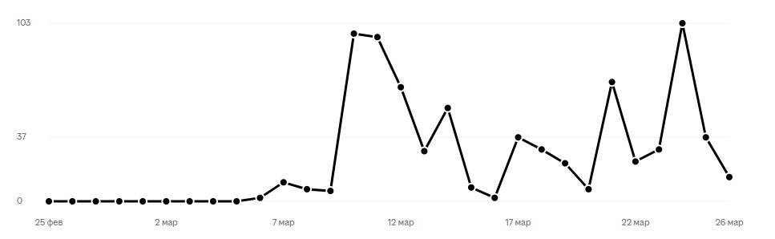

# auto apply

## installation
- intall nodejs https://nodejs.org/en
- install chrome https://www.google.com/chrome/
- open command line and install dependancies `npm i`
- if you would like to use local model:
  - https://ollama.com/download
  - `ollama pull qwen2.5:14b` - itll install qwen2.5:14b which was used as main local model

## preconfig
- fill your personal information below `user related` section of `settings.js`
- fill llm configuration below `llm related` section of `settings.js` // default is gemini-2.0-flash-001
- fill your llm configuration below `HH related` section of `settings.js`

## usage
- close all chrome instances
- run chrome with debugger via command line
  - linux: `/usr/bin/google-chrome-stable --remote-debugging-port=9222`
  - windows: `"C:\Program Files\Google\Chrome\Application\chrome.exe" --remote-debugging-port=9222`
  - macOS: `?`
- `node hh.js`

## how does it work
- launches chrome with debugger on your default profile
- gets on hh.ru to the corrseponding settings.js HH_SEARCH_QUERIES, filters positions by settings.js HH_POSITION_TITLE_KEYWORDS_TO_IGNORE
- gets on position page, tries to open "add cover letter", calls llm.findIfPositionFitsMe(vacancy_text, user_info, user_resume, user_preferences)
- generates cover letter with generateCoverLetter(position_description, user_info, user_resume, user_name)
- you get views on your resume and get invitations on interview\rejects

## TODO:
- multi stage applying: analyze user ( even cache it) -> analyze position -> match user + position -> if match generate cover letter
- hh fill the forms in vacancies
- hh read the chat to reply + fill remote forms
- https://www.zhipin.com/
- global site for applications?

## results
hh.ru

as a conclusion, i may say that ppl do reach my resume by using it

## FAQ
**Q: I dont have local gpu and chatgpt account, can i still use this?**  
**A:** Yep, use google gemini, its free.

**Q: Can my account get banned for using this? And jow to avoid bans?**  
**A:** Automation is most likely against TOS. For violating TOS, your account may get blocked. There is no way to 100% avoid bans. But I'm using it, and no bans yet, so gl. 

**Q: chroimium, headless, requests?**  
**A:** not a tool for scaling, only a helper